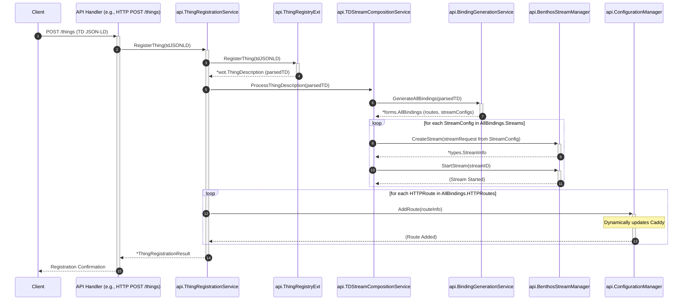
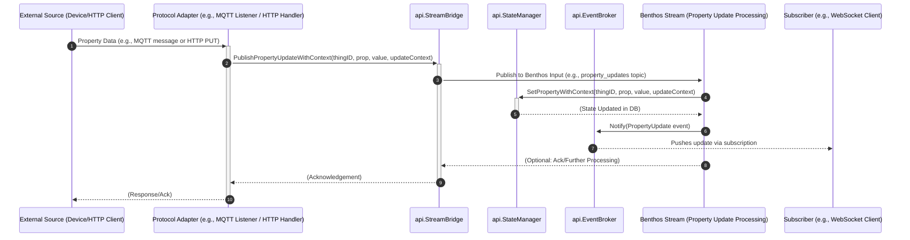
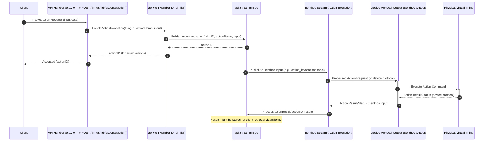

# TwinCore Gateway - Developer Guide

## Table of Contents

1.  [Introduction](#introduction)
2.  [Core Architecture Overview](#core-architecture-overview)
3.  [Main Interfaces](#main-interfaces)
    *   [api.ConfigurationManager](#apiconfigurationmanager)
    *   [api.BenthosStreamManager](#apibenthosstreammanager)
    *   [api.BindingGenerationService](#apibindinggenerationservice)
    *   [api.StateManager](#apistatemanager)
    *   [api.StreamBridge](#apistreambridge)
    *   [api.ThingRegistry / api.ThingRegistryExt](#apithingregistry--apithingregistryext)
    *   [api.SchemaValidator](#apischemavalidator)
    *   [api.ThingRegistrationService](#apithingregistrationservice)
    *   [api.TDStreamCompositionService](#apitdstreamcompositionservice)
    *   [api.CoreProvider](#apicoreprovider)
    *   [types.Service](#typesservice)
    *   [types.License / types.LicenseManager](#typeslicense--typeslicensemanager)
    *   [types.ServiceRegistry](#typesserviceregistry)
    *   [wot.Form](#wotform)
4.  [Key Sequence Flows](#key-sequence-flows)
    *   [Registering a New Thing](#registering-a-new-thing)
    *   [Property Update Flow](#property-update-flow)
    *   [Action Invocation Flow](#action-invocation-flow)

## 1. Introduction

This guide provides technical details for developers working with the TwinCore Gateway. It covers the core interfaces, component responsibilities, and key data flows within the system.

## 2. Core Architecture Overview

TwinCore Gateway integrates a Web of Things (WoT) layer with a Caddy web server and Benthos stream processing. Key aspects include:
-   **Dependency Injection:** The `internal/container` package initializes and wires together all core components.
-   **Caddy Integration:** The `internal/caddy_app` module makes core services available within the Caddy environment. Caddy handles HTTP routing and can be dynamically configured by `ConfigurationManager`.
-   **WoT Abstraction:** `pkg/wot` provides Go structures for Thing Descriptions. Services like `ThingRegistrationService` and `TDStreamCompositionService` process these TDs to configure the system.
-   **Stream Processing:** Benthos is used for data stream processing. `BenthosStreamManager` and `BindingGenerator` are central to creating and managing these streams based on TD affordances.
-   **Service Management:** The `types.Service` interface and `types.ServiceRegistry` manage the lifecycle of different services (e.g., HTTP, Stream, WoT).

## 3. Main Interfaces

This section describes the main interfaces that define the contracts between different components of the TwinCore Gateway.

### api.ConfigurationManager
*   **Purpose:** Manages application-level configurations, including dynamic updates to the Caddy server and potentially other service configurations.
*   **Defined in:** `internal/api/interfaces.go`
*   **Implemented by:** `internal/config.ConfigManager`
*   **Key Methods:**
    *   `IsSetupComplete() bool`: Checks if the initial setup has been performed.
    *   `CompleteSetup(logger logrus.FieldLogger) error`: Marks the initial setup as complete.
    *   `GetAuthProviders(license types.License) []types.AuthProviderInfo`: Retrieves available authentication provider information. (Note: `types.AuthProviderInfo` and `types.AuthConfigRequest` were not explicitly reviewed but are assumed to exist in `pkg/types`).
    *   `ConfigureAuth(logger logrus.FieldLogger, req types.AuthConfigRequest) error`: Configures authentication providers.
    *   `GetConfiguration(logger logrus.FieldLogger) (map[string]interface{}, error)`: Retrieves current system or Caddy configuration.
    *   `UpdateConfiguration(logger logrus.FieldLogger, section string, config map[string]interface{}) error`: Updates a specific section of the configuration.
    *   `RemoveThingRoutes(logger logrus.FieldLogger, thingID string) error`: Removes Caddy routes associated with a specific Thing.

### api.BenthosStreamManager
*   **Purpose:** Manages the lifecycle of Benthos streams (dynamic data pipelines).
*   **Defined in:** `internal/api/interfaces.go`
*   **Implemented by:** `internal/api.SimpleBenthosStreamManager`
*   **Key Methods & Data Types (from `pkg/types`):**
    *   `CreateStream(ctx context.Context, request types.StreamCreationRequest) (*types.StreamInfo, error)`
    *   `UpdateStream(ctx context.Context, streamID string, request types.StreamUpdateRequest) (*types.StreamInfo, error)`
    *   `DeleteStream(ctx context.Context, streamID string) error`
    *   `GetStream(ctx context.Context, streamID string) (*types.StreamInfo, error)`
    *   `ListStreams(ctx context.Context, filters types.StreamFilters) ([]types.StreamInfo, error)`
    *   `StartStream(ctx context.Context, streamID string) error`
    *   `StopStream(ctx context.Context, streamID string) error`
    *   `GetStreamStatus(ctx context.Context, streamID string) (*types.StreamStatus, error)`
    *   `CreateProcessorCollection(ctx context.Context, request types.ProcessorCollectionRequest) (*types.ProcessorCollection, error)`
    *   `GetProcessorCollection(ctx context.Context, collectionID string) (*types.ProcessorCollection, error)`
    *   `ListProcessorCollections(ctx context.Context) ([]types.ProcessorCollection, error)`

### api.BindingGenerationService
*   **Purpose:** Generates all necessary bindings (e.g., HTTP routes, Benthos stream configurations) from a WoT Thing Description.
*   **Defined in:** `internal/api/interfaces.go`
*   **Implemented by:** `pkg/wot/forms.BindingGenerator`
*   **Key Methods:**
    *   `GenerateAllBindings(logger logrus.FieldLogger, td *wot.ThingDescription) (*forms.AllBindings, error)`

### api.StateManager
*   **Purpose:** Manages the state of Thing properties.
*   **Defined in:** `internal/api/interfaces.go`
*   **Implemented by:** `internal/api.BenthosStateManager`
*   **Key Methods:**
    *   `GetProperty(thingID, propertyName string) (interface{}, error)`
    *   `SetProperty(logger logrus.FieldLogger, thingID, propertyName string, value interface{}) error`
    *   `SetPropertyWithContext(logger logrus.FieldLogger, ctx context.Context, thingID, propertyName string, value interface{}) error`
    *   `SubscribeProperty(thingID, propertyName string) (<-chan models.PropertyUpdate, error)`
    *   `UnsubscribeProperty(thingID, propertyName string, ch <-chan models.PropertyUpdate)`

### api.StreamBridge
*   **Purpose:** Connects WoT interactions to the Benthos stream system.
*   **Defined in:** `internal/api/interfaces.go`
*   **Implemented by:** `internal/api.BenthosStreamBridge`
*   **Key Methods:**
    *   `PublishPropertyUpdate(logger logrus.FieldLogger, thingID, propertyName string, value interface{}) error`
    *   `PublishPropertyUpdateWithContext(logger logrus.FieldLogger, ctx context.Context, thingID, propertyName string, value interface{}) error`
    *   `PublishActionInvocation(logger logrus.FieldLogger, thingID, actionName string, input interface{}) (string, error)`
    *   `PublishEvent(logger logrus.FieldLogger, thingID, eventName string, data interface{}) error`
    *   `GetActionResult(logger logrus.FieldLogger, actionID string, timeout time.Duration) (interface{}, error)`
    *   `ProcessActionResult(logger logrus.FieldLogger, result map[string]interface{}) error`

### api.ThingRegistry / api.ThingRegistryExt
*   **Purpose:** Manages storage and retrieval of Thing Descriptions. `ThingRegistryExt` adds lifecycle methods.
*   **Defined in:** `internal/api/interfaces.go`
*   **Implemented by:** `internal/config.ThingRegistry` (adapted via `container.ThingRegistryAdapter`)
*   **Key Methods (`ThingRegistry`):** `GetThing`, `GetProperty`, `GetAction`, `GetEvent`
*   **Additional Methods (`ThingRegistryExt`):** `RegisterThing`, `UpdateThing`, `DeleteThing`, `ListThings`

### api.SchemaValidator
*   **Purpose:** Validates data against WoT DataSchemas.
*   **Defined in:** `internal/api/interfaces.go`
*   **Implemented by:** (Assumed `internal/api.WoTSchemaValidator` or similar)
*   **Key Methods:** `ValidateProperty`, `ValidateActionInput`, `ValidateEventData`

### api.ThingRegistrationService
*   **Purpose:** Orchestrates Thing registration, including stream and route setup.
*   **Defined in:** `internal/api/interfaces.go`
*   **Implemented by:** `internal/api.DefaultThingRegistrationService`
*   **Key Methods:** `RegisterThing`, `UpdateThing`, `UnregisterThing`, `GetThingWithStreams`

### api.TDStreamCompositionService
*   **Purpose:** Manages Benthos streams based on Thing Descriptions.
*   **Defined in:** `internal/api/interfaces.go`
*   **Implemented by:** `internal/api.DefaultTDStreamCompositionService`
*   **Key Methods:** `ProcessThingDescription`, `UpdateStreamsForThing`, `RemoveStreamsForThing`, `GetStreamCompositionStatus`

### api.CoreProvider
*   **Purpose:** Provides core components access within Caddy.
*   **Defined in:** `internal/api/interfaces.go`
*   **Implemented by:** `internal/caddy_app.TwinCoreApp`
*   **Key Methods (Getters for):** `Logger`, `StateManager`, `StreamBridge`, `ThingRegistry`, `EventBroker`, `BenthosStreamManager`, `ConfigurationManager`.

### types.Service
*   **Purpose:** Generic interface for manageable application services.
*   **Defined in:** `pkg/types/config.go`
*   **Implemented by:** Services in `service/`
*   **Key Methods:** `Name`, `RequiredLicense`, `Dependencies`, `Start`, `Stop`, `UpdateConfig`, `HealthCheck`.

### types.License / types.LicenseManager
*   **Purpose:** `License` checks features. `LicenseManager` validates licenses.
*   **Defined in:** `pkg/types/config.go`
*   **Key Methods:** `License.IsFeatureEnabled`, `LicenseManager.ParseAndValidate`.

### types.ServiceRegistry
*   **Purpose:** Manages the lifecycle of `types.Service` instances.
*   **Defined in:** `pkg/types/config.go`
*   **Implemented by:** `service.ServiceRegistry`
*   **Key Methods:** `RegisterService`, `LoadPermittedServices`, `StartService`, `StopService`.

### wot.Form
*   **Purpose:** Interface for protocol binding forms in a TD.
*   **Defined in:** `pkg/wot/core.go`
*   **Implemented by:** `pkg/wot/forms.HTTPForm`, `pkg/wot/forms.KafkaForm`, etc.
*   **Key Methods:** `GetOp`, `GetHref`, `GetContentType`, `GenerateConfig`, `GetProtocol`.

## 4. Key Sequence Flows

### Registering a New Thing
This flow describes how a new Thing Description (TD) is submitted, processed, and how its streams and routes are configured.

**Explanation:**
1.  A client submits a new Thing Description (TD).
2.  The API Handler calls `ThingRegistrationService.RegisterThing`.
3.  The TD is stored via `ThingRegistryExt.RegisterThing`.
4.  `TDStreamCompositionService.ProcessThingDescription` is called.
5.  This service uses `BindingGenerationService.GenerateAllBindings` to create route and Benthos stream configurations from the TD.
6.  Resulting Benthos streams are created and started via `BenthosStreamManager`.
7.  HTTP routes are added to Caddy via `ConfigurationManager`.
8.  A confirmation is sent to the client.

### Property Update Flow
Describes how a property update (e.g., from a device) is processed and disseminated.

**Explanation:**
1.  An external source sends new property data.
2.  A Protocol Adapter receives this and calls `StreamBridge.PublishPropertyUpdateWithContext`, providing an `UpdateContext` to prevent cycles.
3.  `StreamBridge` publishes to a Benthos input.
4.  An `InternalStream` Benthos pipeline consumes the update.
5.  It calls `StateManager.SetPropertyWithContext` to update the property's state, passing the context.
6.  The `StateManager` (or the stream) notifies the `EventBroker`.
7.  `EventBroker` disseminates the update to subscribers (e.g., WebSocket clients).

### Action Invocation Flow
Describes how an action is invoked on a Thing.

**Explanation:**
1.  Client requests an action invocation via an API endpoint.
2.  The `APIHandler` routes to a `WoTHandler` (or similar business logic component).
3.  `WoTHandler` calls `StreamBridge.PublishActionInvocation`, which sends the request into the Benthos system and returns an `actionID`.
4.  The `actionID` is returned to the client for tracking.
5.  An `ActionStream` (Benthos pipeline) consumes the invocation.
6.  This stream processes the request and uses a `DeviceAdapter` (a Benthos output) to send the command to the `ActualDevice` in its native protocol.
7.  The `ActualDevice` executes the command and returns a result.
8.  The result is picked up by a Benthos input (via the `DeviceAdapter`) and processed by another stream, which then calls `StreamBridge.ProcessActionResult`.
9.  `StreamBridge` makes the result available for later retrieval by the client using the `actionID`.
